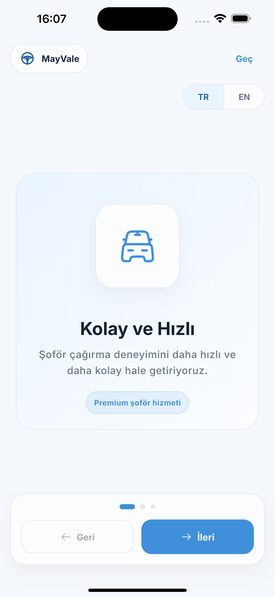
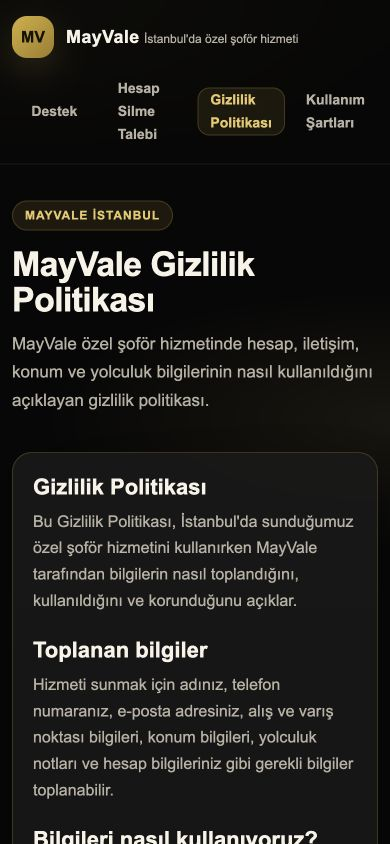
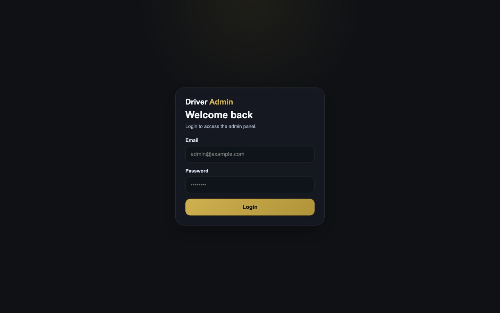

# MayVale

A chauffeur customer app with server-managed quotations, reservation validation and an operations back office.

This is a documentation and visual showcase. The application source code is not included. Technical descriptions and earlier test results come from the prepared project documentation; those application tests were not repeated for this export.

**Portfolio:** [English](https://ideabat.com/portfolio/mayvale-chauffeur-booking-platform/) · [Türkçe](https://ideabat.com/tr/portfolio/mayvale-chauffeur-booking-platform/) · [العربية](https://ideabat.com/ar/portfolio/mayvale-chauffeur-booking-platform/)

**Case study:** [English](https://ideabat.com/case-study/mayvale-chauffeur-booking-operations/) · [Türkçe](https://ideabat.com/tr/case-study/mayvale-chauffeur-booking-operations/) · [العربية](https://ideabat.com/ar/case-study/mayvale-chauffeur-booking-operations/)

## Ragıp Mullamusa’s contribution

I developed MayVale for a chauffeur-service client through Ideabat, spanning Flutter UI, JSON services, PHP/PDO backend, relational persistence, administration and Turkish/English content. Drivers are managed operational records, not a second mobile app. Ideabat is the software developer, not the chauffeur operator.

## At a glance

| Layer | Purpose |
|---|---|
| Flutter/Dart customer app | Service discovery, route review, reservations and profile flows |
| PHP/PDO backend | Quote authority and reservation validation |
| MySQL/MariaDB | Reservation, quote and acknowledgement persistence |
| Web administration | Customer, driver, order and localized content operations |
| Public pages | Support and legal information |
| Localization | Turkish and English app; Arabic is portfolio content only |

## Price authority belongs to the reservation service

This conceptual diagram summarizes the documented implementation. An expiring quote connects what the customer reviewed with what the server can accept. A changed tariff requires renewed review. Versioned document acknowledgements are committed with the reservation, making the stored context inspectable without claiming legal compliance.

## Visual evidence is deliberately limited

The three available captures show native onboarding, public guidance and the empty administration entry screen. They do not show a completed reservation or authenticated operations. Populated operational imagery and a full database-dependent runtime demonstration remain unavailable in the supplied package.

A technical case study of a client chauffeur platform: server-owned pricing, versioned acknowledgements and a shared operations backend.

## Context and objective

A chauffeur request crosses two interfaces: the customer's booking experience and the operator's service records. MayVale's implementation connects them through a Flutter application, native PHP services and a relational data model. Ideabat built this system for a client. The scope supports a concrete objective: preserve the journey, quotation and review context as the request becomes a reservation.

No client interview, baseline operational study or measured outcome was supplied. The problem described here follows the software's data and workflow requirements, not an invented history of the customer's business.

## Users and paths

The customer app has Home, Services, Reservations and Profile tabs. Route-based booking uses pickup/destination coordinates and a scheduled time. Intercity and night-chauffeur services use catalog/detail/contact paths. Administrators work with customer, driver and order records; super-admin guards restrict sensitive editing. Drivers are managed records, not a separate mobile app.

## Quotation boundary

The Flutter route service sends coordinates to the quotation endpoint. The backend obtains route meters, duration and polyline, evaluates the configured distance tariff and persists an expiring quote. A route above the automatic range returns no automatic price. Reservation creation rechecks the persisted quote's coordinates, expiry and current tariff. A price change asks the client to refresh its review rather than trusting the originally displayed number.

That separation places price authority on the server. It does not verify that every live Google request succeeds; live external routing was not exercised here.

## Review and persistence

The app loads required documents with versions derived from their content. Both acknowledgement flags must be true and refer to the expected versions/languages. Within one transaction the backend inserts the reservation, stores the acknowledged document snapshots and links the consumed quote. Retrying a consumed quote can return the original reservation to the same customer. Missing or changed documents block submission.

Snapshot storage is an engineering capability, not a legal-compliance certification.

## Operations and content

The PHP administration interface uses shared session, CSRF, rendering and PDO helpers. Customer/driver/order management and localized service/legal content editing share the database. Services have localized titles, descriptions and package records. Night packages are information/contact offers; they do not create new map-booking types.

## Architecture and constraints

Flutter screens call service classes, which consume PHP JSON endpoints. PHP owns reservation validation and database writes. Public support/legal pages use a separate shared PHP renderer and can run without the database. Turkish and English are implemented app locales; Arabic is a publication language for this case study only.

The available verification does not establish a full database-dependent reservation journey.

## Evidence-backed delivery

The inspected implementation provides explicit quotation and reservation contracts, localized service discovery and an operational administration layer. PHP pricing/document tests and all eight Flutter tests passed. Public pages opened locally, and native launch/capture evidence is listed in the media manifest. These are verified engineering observations; no claimed reduction in workload, increase in bookings or customer endorsement is attached.

[View the public Android listing](https://play.google.com/store/apps/details?id=mayvale.ideabat.com). The listing does not establish release of this checkout's update.

Developed by Ideabat for a client, with hands-on development by Ragıp Mullamusa. [Discuss a comparable workflow with Ideabat](https://ideabat.com).

## Screen walkthrough

These real application captures come from the project’s prepared publication material. Demonstration records are synthetic; a screen illustrates the interface, not a production deployment or a permission test.

### 01 — MayVale privacy guidance in Turkish, displayed in the dark responsive public page.

### 02 — MayVale administration login with empty email and password fields on a dark desktop page.

### 03 — MayVale iOS onboarding in Turkish, with TR and EN language choices and a blue chauffeur illustration.

## Evidence and availability

Implementation and historical validation descriptions above are supported by the project’s prepared documentation. The application tests were not rerun for this documentation export. The screenshots demonstrate the captured version, not current service availability, customer adoption or measured commercial outcomes.

## Ownership and technical review

This repository contains documentation and approved visual material, not an application source release. Presentation through Ideabat does not transfer a client’s ownership. For employment, collaboration or technical-review inquiries, contact Ragıp Mullamusa through Ideabat. Access to client-owned source requires prior permission from the project owner and compliance with applicable confidentiality requirements. Requests are reviewed individually; source access is not guaranteed. No software license or redistribution permission is granted by this showcase.

## Contact

Ragıp Mullamusa is the founder of [Ideabat](https://ideabat.com/). For relevant engineering, employment or collaboration inquiries, use [the contact page](https://ideabat.com/contact-us/) or [info@ideabat.com](mailto:info@ideabat.com).
